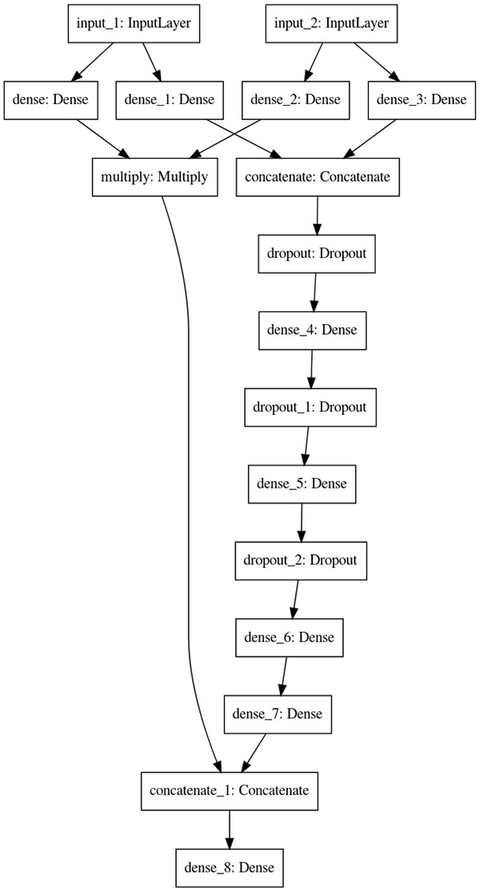
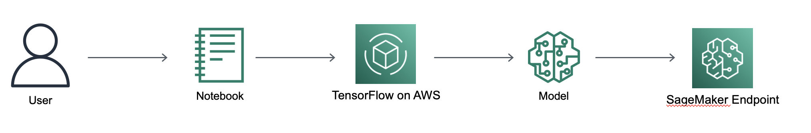

# 🌟 Custom Recommender System using Neural Collaborative Filtering 🧠

&nbsp;&nbsp;&nbsp;&nbsp;&nbsp;&nbsp;

&nbsp;&nbsp;&nbsp;&nbsp;&nbsp;&nbsp;

This repository contains a Jupyter notebook 📓 that demonstrates how to build a custom recommender system using Neural Collaborative Filtering (NCF) on Amazon SageMaker ☁️.

## 📚 About Neural Collaborative Filtering

Neural Collaborative Filtering is a deep learning-based approach 🚀 for making recommendations. Traditional collaborative filtering methods solely rely on the interaction between users and items, neglecting any additional features that may help improve the recommendation quality. NCF, on the other hand, adopts a multi-layer perceptron 🎛️ to learn the user-item interaction function, effectively infusing the flexibility of neural networks into collaborative filtering. This makes NCF a powerful model for recommendation systems where the interaction data is very sparse.

NCF incorporates the benefits of both collaborative filtering and neural networks, providing a more flexible and effective approach to capturing user-item interactions. In the provided notebook, we implement this approach using TensorFlow 2.0 💻, a popular deep learning framework, and Amazon SageMaker, a fully managed service that provides every developer and data scientist with the ability to build, train, and deploy machine learning (ML) models quickly 💫.

## 🔬 NCF Architecture

## 🗂️ Data

The notebook uses the MovieLens dataset 🎬, which is a widely used dataset for building recommendation systems. MovieLens is provided by GroupLens, a research lab at the University of Minnesota. It contains movie ratings from users, providing a rich dataset for studying user-item interactions 🧪.

## 📘 Notebook Contents

The Jupyter notebook is divided into several sections:

1. **Background 🌐**: This section provides some context and theoretical background about the problem and the chosen solution. It discusses the advantages of using Neural Collaborative Filtering over traditional methods and the relevance of the MovieLens dataset for the task at hand.

2. **Data Preparation 🧹**: This part involves downloading the MovieLens dataset and preprocessing it for the recommendation task. It likely includes steps such as data cleaning, normalization, and splitting the data into training and test sets 📊.

3. **NCF Network in TensorFlow 2.0 🕸️**: This section deals with the creation and configuration of the NCF model using TensorFlow 2.0. It explains how to define the architecture of the NCF model, including the input layers, hidden layers, output layers, and the loss function.

4. **Perform Model Training using Script Mode 💪**: This section explains how to train the configured model using Amazon SageMaker's Script Mode. Script Mode is a training script format for Amazon SageMaker, which lets you execute any compatible training script in SageMaker with minimal modification. The section will guide you on how to prepare a training script for execution in SageMaker.

5. **Deploy the Trained Model using Amazon SageMaker Hosting Services as an Endpoint 🚀**: This part shows how to deploy the trained model as a hosted endpoint using Amazon SageMaker. This is an important step as it allows the model to serve predictions in real-time ⏱️.

6. **Run Inference using the Model Endpoint 🔍**: Finally, this section demonstrates how to make inference requests to the deployed model endpoint. It might include sending a single request or a batch of requests to the model endpoint and processing the returned predictions.

## 👩‍💻 Usage

To use this notebook:

1. Clone the repository to your local machine or cloud environment 🖥️.
2. Make sure you have the necessary Python packages installed (see "Requirements" below) 🔧.
3. Open the Jupyter notebook and follow the steps outlined in it 📖.

## 📜 Requirements

To run this notebook, you'll need:

- Python 3.x 🐍
- Jupyter Notebook 📓
- AWS SDK for Python (Boto3) 🗄️
- Amazon SageMaker Python SDK 🌐
- TensorFlow 2.x 🧠

## 🏗️ Solution Architecture 

## 🤝 Contribute

Please feel free to fork this repository, submit PRs, and raise issues 🛠️.

## ⚖️ License

This project is licensed under the terms of the MIT license 📄.
